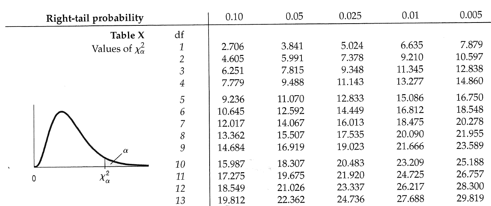
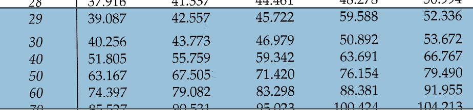

```{r setup, include=FALSE}
knitr::opts_chunk$set(echo = FALSE, message=FALSE,
                      dev='pdf', fig.width=4, fig.asp=0.618, fig.align='center')
options(tibble.width=70, scipen = 999)
```

# goodness-of-fit testing ("Comparing Counts", Ch. 23 of textbook)

## detour 1 - what tends to have a Normal distribution?

In Stats 101 you will have encountered (at least) Binomial and Normal distribuions. 

\pause And we've learned that $\overline X$ is always approximately Normal when the sample is large enough.

Sums of random things also tend to be approximately Normal.

\pause A special case is the so-called "Normal approximation to the Binomial".

\pause Why? Recall that a Binomial probability model is used to *count* the number of *"successes"* in $n$ "trials". 

\pause Let's map "success" to the number 1 and "failure" to the number 0.

**Counting 1s in a sequence of 0s and 1s is exactly equivalent to adding up all the 0s and 1s**

## detour 2.1 - what happens when you look at the square of a normal?

My compute can simulate random "draws" from a standard normal (N(0,1)) distribution, resulting in a histogram such as:

```{r, message=FALSE}
library(tidyverse)

k <- 10000
data_frame(z = rnorm(k)) %>% 
  ggplot(aes(x=z)) + geom_histogram(bins=30) + ggtitle("10000 Simulated N(0,1)")
```

## detour 2.2 - what what happens when you look at the square of a normal?

I could take all of those simulated standard normals and square them, and make a histogram of the result, which would give:

\pause

```{r}
as.data.frame(replicate(1, rnorm(k))) %>% 
  mutate(sq=V1^2) %>% 
  ggplot(aes(x=sq)) + geom_histogram(bins=30, boundary=0) + ggtitle("10000 squared normals") + xlab("")
```

## detour 2.3 - sum of squared normals?

I can simulate *two* columns of standard normals, square them *both*, add the results, and make a histogram of the result:

\pause

```{r}
data_frame(ssq=apply(replicate(2, rnorm(k)), 1, function(x) sum(x^2))) %>% 
  ggplot(aes(x=ssq)) + geom_histogram(bins = 40, boundary=0) + ggtitle("10000 sums of two squared normals") + xlab("")
```

## detour 2.4 - sum of many squared normals?

I can make several columns of normals, square them, add them up, and make a histogram. Here's the histogram with 5 columns of normals:

```{r}
data_frame(ssq=apply(replicate(5, rnorm(k)), 1, function(x) sum(x^2))) %>% 
  ggplot(aes(x=ssq)) + geom_histogram(bins = 40, boundary=0) + ggtitle("10000 sums of five squared normals") + xlab("")
```

## detour - the $\chi^2$ family of distributions

If you have $n$ independent standard normals, the sum of their squares will have a $\chi^2_n$ distribution. 

\pause The $n$ is a parameter going by the name "degrees of freedom."

\pause If you have $n$ general $N(\mu, \sigma)$, say called $X_1,X_2,\ldots,X_n$, you could *standardize them*:
$$Z_i = \frac{X_i - \mu}{\sigma}$$
and then the sums of the squares of these $Z_i$ will have a $\chi^2_n$ distribution.

\pause 

## detour - pictures of some $\chi^2_n$ distributions

```{r}
x <- seq(0, 15, by=0.1)
data_frame(x) %>% 
  mutate(chisq_1 = dchisq(x, 1),
         chisq_2 = dchisq(x, 2),
         chisq_5 = dchisq(x, 5)) %>% 
  gather(key=Distribution, value=Density, -x) %>% 
  ggplot(aes(x, y=Density, color=Distribution)) + geom_line()
```

## detour - pictures of more $\chi^2_n$ distributions

```{r}
x <- seq(0, 60, by=0.3)
data_frame(x) %>% 
  mutate(chisq_10 = dchisq(x, 10),
         chisq_20 = dchisq(x, 20),
         chisq_30 = dchisq(x, 30)) %>% 
  gather(key=Distribution, value=Density, -x) %>% 
  ggplot(aes(x, y=Density, color=Distribution)) + geom_line()
```

Note: the average of a $\chi^2_n$ distribution is just $n$. 

## ever wonder why the sample variance is divided by $n-1$?

Look at the formula for sample variance:
$$s^2 = \frac{\sum\limits_{i=1}^n (x_i - \overline{x})^2}{n-1}$$
The numerator is a sum of $n$ squares, but the denominator is $n-1$. Why?

## pictures of $\sum\limits_{i=1}^5 (x_i - \overline{x})^2$

I can simulate samples of size, say, 5 and compute that numerator, and make a histogram.

\pause Here it is, with the $\chi^2_4$ distribution in blue and the $\chi^2_5$ in red:

```{r}

data.frame(ssq=apply(replicate(k, rnorm(5)), 2, 
                     function(x) sum((x-mean(x))^2))) %>% 
  ggplot(aes(x=ssq)) + geom_histogram(aes(y=..density..), bins=50, boundary=0) + xlab("") + 
  stat_function(fun=dchisq, args=list(df=4), color="Blue") + 
  stat_function(fun=dchisq, args=list(df=5), color="Red")
```

## a heuristic explanation

$s^2$ is calculated after fixing the value of $\overline{x}$

\pause So given $\overline{x}$ and *any* $n-1$ of the $n$ raw values, I can calculate that other raw value. 

\pause We say $s^2$ (given $\overline{x}$) only has $n-1$ degrees of freedom. 

# is there evidence that something doesn't follow a given distribution?

## is a lottery "fair"

Lotto 6/49 is a Canadian lottery in which 49 identical balls are mixed together and 7 are selected, now twice per week. People can win money based on how many of the numbers they have out of the 6 on their ticket.

I found a list of every number ever picked here: http://portalseven.com/lottery/canada_lotto_649.jsp

```{r}
library(readxl)
options(tibble.print_min=5)
lotto <- read_excel("649.xlsx")
lotto
```

## all 49 numbers should appear with roughly the same frequency

```{r}
all_numbers <- gather(lotto, "number", "numbers", 2:8) %>% 
  select(numbers) %>% 
  filter(!is.na(numbers)) %>% 
  mutate(numbers=factor(numbers))

all_numbers %>% 
  ggplot(aes(x=factor(numbers))) + geom_bar() + 
  theme(axis.title.x=element_blank(), axis.text.x = element_blank())
```

## categorical data, cells, observed cell counts

The dataset (now) consists of one variable called `numbers`. This is a *categorical*, or *factor* variable with 49 possible *levels*. There are `r nrow(all_numbers)` observations.

\pause A categorical variable is summarized by producing a table of *observed cell counts* (notation: $O_i$). In this case:

```{r}
all_numbers %>% 
  group_by(numbers) %>% 
  summarize(O_i=n())
```

## expected cell counts

If Lotto 6/49 is actually fair, each number would appear with probability 1/49 = `r round(1/49, 4)` each.

After `r nrow(all_numbers)` numbers have been selected, we would expect to see:
$$`r nrow(all_numbers)`\cdot\frac{1}{49} = `r round(nrow(all_numbers)/49, 2)`$$
of each number.

These are called *expected cell counts* --- calulated under the assumption of fairness as defined in this example. (Notation: $E_i$)

## measuring the deviation from the assumption of fairness

Each $O_i$ is a count (i.e. a sum of 0s and 1s), which will have an approximate normal distribution. It turns out:
$$\frac{O_i - E_i}{\sqrt{E_i}}$$
has a standard normal distribution, as long as there are enough 1s in the sample.

\pause How many? As long as $E_i \ge 10$, the approximation will be good.

\pause (Note: this is exactly like the $np \ge 10$ or $np \ge 5$ suggestion that is given for the accuracy of a normal approximation to a binomial.)

\pause The overall deviation is measured as:
$$\sum\limits_{i=1}^n \left(\frac{O_i - E_i}{\sqrt{E_i}}\right)^2 = 
\sum\limits_{i=1}^n \frac{(O_i - E_i)^2}{E_i}$$

## measuring the deviation - compared to what?

The expected cell counts $E_i$ are computed *for a given fixed sample size*  $n.$

\pause So given $n$ along with any of the $n-1$ expected cell counts, we could compute that other expected cell count.

\pause (This might *seem* trivial in this example because all the expected cell counts are the same - but this is only because our hypothesis is that all the cell probabilities are the same.)

\pause We say
$$\sum\limits_{i=1}^n \frac{(O_i - E_i)^2}{E_i}$$
has $n-1$ degrees of freedom, and it follows (approximately) a $\chi^2_{n-1}$ distribution. 

## let's measure the deviation

Here are the first few deviations (with $(O_i-E_i)^2/E_i$ called `D_i` for short):

```{r}
all_numbers_calc <- all_numbers %>% 
  group_by(numbers) %>% 
  summarize('O_i'=n()) %>% 
  mutate('E_i'=round(nrow(all_numbers)/49, 2), D_i = (O_i-E_i)^2/E_i) 
all_numbers_calc
```
The sum of the `D_i` column is `r round(sum(all_numbers_calc$D_i), 2)`. Is this number surprising?

## surprising, compared to what?

We know we should compare this number with the $\chi^2_{48}$ distribution. Here we can see we are not surprised. There is no evidence that Lotto 6/49 is unfair.

```{r}
x <- seq(0.1, 100, by=0.5)
plot(x, dchisq(x, 48), type='l', ylab="", xlab="", main="Chi-sq with 48 df")
abline(v = sum(all_numbers_calc$D_i), col="red", lwd=2)
```

## goodness of fit as formal hypothesis test - I 

Goodness-of-fit testing is a form of hypothesis testing.

\pause The null hypothesis is the result of statement that data follows a certain distribtuion of interest. 

\pause In the Lotto example, technically this statement is:
$$H_0: p_1 = p_2 = \cdots = p_{49} = \frac{1}{49}$$
But usually we just make $H_0$ a simple written statement:
$$H_0: \text{ the probabilities are all the same. }$$

\pause The "distribution of interest" is technically the "discrete uniform distribution on the outcomes $\{1,2,3,\ldots,49\}$"

\pause The alternative hypothesis is the negation of the null. We don't normally bother to write it down.

## goodness of fit as formal hypothesis test - II

Given a sample size $n$ and the null hypothesis probabilities, compute the expected cell counts. In this case:
$$E_i = np_i = `r nrow(all_numbers)`\cdot\frac{1}{49} = `r round(nrow(all_numbers)/49, 2)`$$

\pause Compute the *observed value of the test statistic*:
$$\chi^2_{\text{obs}} = \sum\limits_{i=1}^n \frac{(O_i - E_i)^2}{E_i} = `r round(sum(all_numbers_calc$D_i), 2)`$$

\pause Calculate the p-value based on $\chi^2_{\text{obs}}$ being approximately $\chi^2_{n-1}$.

## goodness-if-fit testing p-value

A p-value is the *probability of observing a more extreme value*, in the sense of being further from where the null hypothesis "lives", which is where in this case?

```{r}
x <- seq(0, 60, by=0.3)
data_frame(x) %>% 
  mutate(chisq_10 = dchisq(x, 10),
         chisq_20 = dchisq(x, 20),
         chisq_30 = dchisq(x, 30)) %>% 
  gather(key=Distribution, value=Density, -x) %>% 
  ggplot(aes(x, y=Density, color=Distribution)) + geom_line()
```

## goodness-of-fit testing p-value

The p-value is $P(\chi^2_{48} \ge `r round(sum(all_numbers_calc$D_i), 2)`) = 
`r pchisq(sum(all_numbers_calc$D_i), 48, lower=FALSE)`$

\pause On tests you'll need to use a table. Here's a close-up of the book's table:



## goodness-of-fit testing p-value (from table)



From a table the best you can do is to estimate the p-value.

***All this together is called the "$\chi^2$ goodness-of-fit test."***

# applications of $\chi^2$ goodness-of-fit testing to two-way tables

## contingency tables

Recall the gas pipelines data:

```{r}
gas <- read_excel("pipeline.xlsx", col_types = rep("text", 4))
gas <- gas %>% 
  mutate(Leak=factor(Leak), Size=factor(Size, levels=c("1","1.5","1.75"), ordered=TRUE),
         Material=factor(Material), Pressure=factor(Pressure))
gas
```

The (only?) suitable numerical summary for two categorical/factor variables at a time is a so-called contingency table, or two-way table.

## two-way table for "Leak" and "Pressure"

```{r, results='asis'}
library(xtable)
print(xtable(addmargins(table(gas$Leak, gas$Pressure)), digits = 0),
      comment = FALSE)
```

## the two questions

Question 1: do the rows (or columns) come from the *same* distribution?

\pause This question is answered using a *test of homogeneity*.

\pause Question 2: are the rows and columns *independent*?

\pause This question is answered using a *test of independence*.

\pause ***The mechanics of both tests are identical. Only the interpretation is (slightly) different.***

## two-way table again

Count version:

```{r, results='asis'}
library(xtable)
print(xtable(addmargins(table(gas$Leak, gas$Pressure)), digits = 0),
      comment = FALSE)
```

Proportion version:

```{r, results='asis'}
library(xtable)
print(xtable(addmargins(prop.table(table(gas$Leak, gas$Pressure))), digits = 3),
      comment = FALSE)
```
